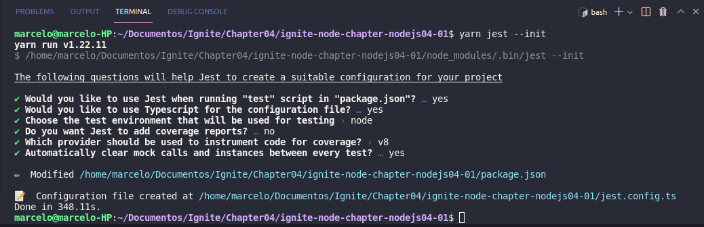
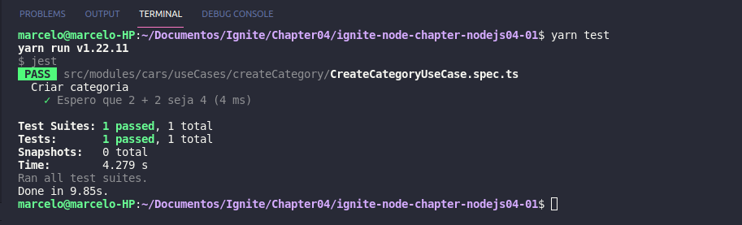
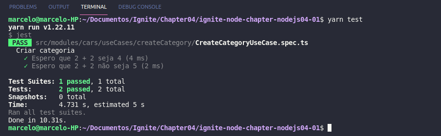
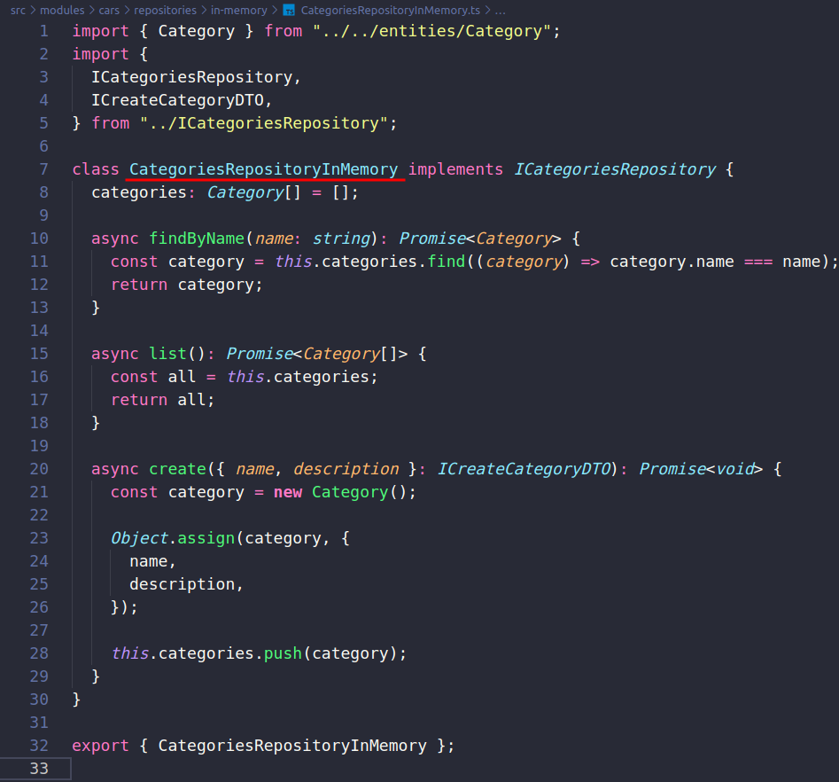
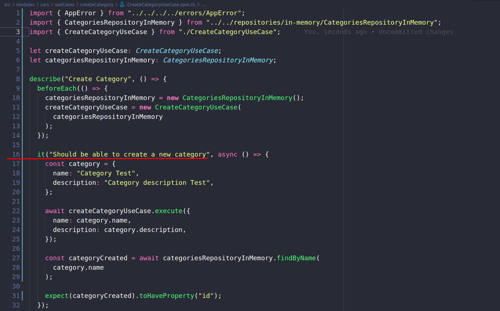
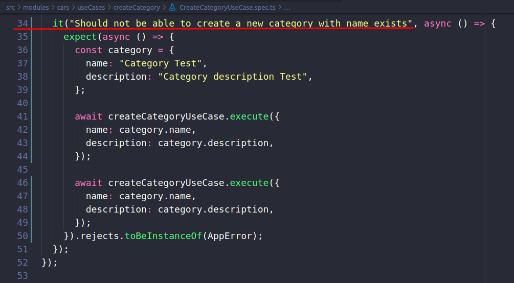
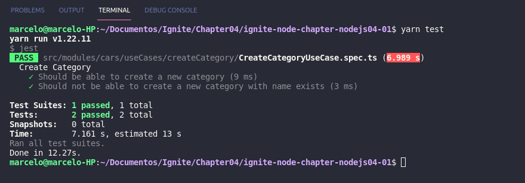

# ignite-node-chapter-nodejs04-01

Chapter IV - Testes e regras de negócio

## 1. Introdução

## 2. Conhecendo os tipos de testes

1 - Teste unitários

2 - Teste de Integração
-> routes -> controllers -> useCases -> repository

<- repository <- useCases <- controllers <- routes

- ` Metodologia:`
TDD - Test Driven Development

Inicia fazendo os teste e depois criando toda o resto da aplicação.


## 3. Criando o primeiro teste

Biblioteca utilizada nos teste:
https://jestjs.io/pt-BR/docs/getting-started

### 3.1 - Instalar como dependencia de desenvolvimento:
`yarn add jest @types/jest -D`

### 3.2 - Configuração adicional:
Gerando um arquivo de configuração básico.
Com base no seu projeto, o Jest fará algumas perguntas e irá criar um arquivo básico de configuração com uma breve descrição para cada opção:
`yarn jest --init`

? Would you like to use Jest when running "test" script in "package.json"? › (Y/n) Y

? Would you like to use Typescript for the configuration file? › (y/N) Y

? Choose the test environment that will be used for testing › - Use arrow-keys. Return to submit.
❯   node       -> Enter


? Do you want Jest to add coverage reports? › (y/N) N

? Which provider should be used to instrument code for coverage? › - Use arrow-keys. Return to submit.
❯   v8         -> Enter


? Automatically clear mock calls and instances between every test? › (y/N) Y

<h1 align="center">
    
</h1>


### 3.3 - Instalar dependencia de desenvolvimento:
`yarn add ts-jest -D`

Agora dentro do arquivo jest.config.ts vamos fazer a segui alteração:
Descomentar:
preset: undefined,

E trocar ela para:
preset: "ts-jest",

E apontar o mapeamento das crasses para fazer o testes:
Descomentar:
```
testMatch: [
    "**/__tests__/**/*.[jt]s?(x)",
    "**/?(*.)+(spec|test).[tj]s?(x)"
  ],
```

E Mudar para:
```
testMatch: ["**/*.spec.ts"],
```

Para que ele pare apos o primeiro error.
Descomentar:
```
bail: 0,
```

E Mudar para:
```
bail: true,
```

Criar o primeiro teste:
1 - Criar dentro de src/modules/cars/useCases um arquivo:
  CreateCategoryUseCase.spec.ts

Ex 1:
```
describe("Criar categoria", () => {
  it("Espero que 2 + 2 seja 4", () => {
    const soma = 2 + 2;
    const resultado = 4;

    
    expect(soma).toBe(resultado);
  });
});
```
Eu espero que minha soma seja o resultado 4

E roda o exemplo:
`yarn test`

<h1 align="center">
    
</h1>


Ex 2:
```
describe("Criar categoria", () => {
  it("Espero que 2 + 2 seja 4", () => {
    const soma = 2 + 2;
    const resultado = 4;

    
    expect(soma).toBe(resultado);
  });

  it("Espero que 2 + 2 não seja 5", () => {
    const soma = 2 + 2;
    const resultado = 5;

    expect(soma).not.toBe(resultado);
  });
});
```
Agora o teste esta negando que o resultado seja 5

E roda o exemplo:
`yarn test`

<h1 align="center">
    
</h1>


## Teste de criação de categoria

Dentro de src/modules/cars/repositories 
Vamos criar uma nova pasta pra colocar os repositorios fakes, chamada:
in-memory
  E dentro de in-memory um arquivo: CategoriesRepositoryInMemory.ts

Para fazer a implementação: Ctrl + .

<h1 align="center">
    
</h1>

Continua a implematção dentro do CreateCategoryUseCase.spec.ts

```Should be able to create a new category```
<h1 align="center">
    
</h1>

```Should not be able to create a new category with name exists```
<h1 align="center">
    
</h1>

E roda o teste de criação de categoria:
`yarn test`

<h1 align="center">
    
</h1>

